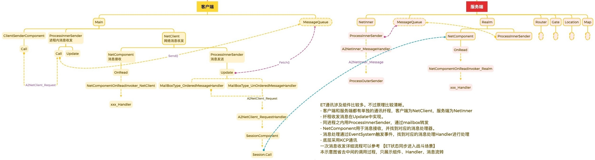
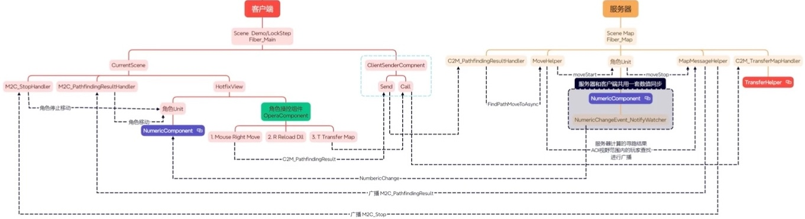
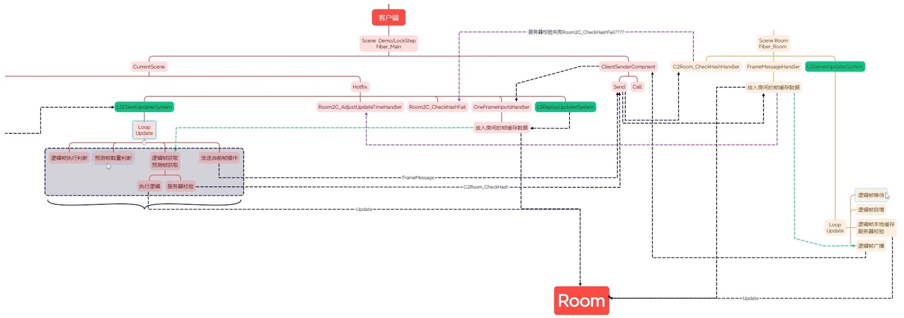

# 代码阅读记录

## 术语&机制

### 代码生成
ET中有很多自动生成的代码，如[[EntitySystem]](../Share/Share.SourceGenerator/Generator/ETSystemGenerator/ETSystemGenerator.cs)主要依赖于 C# 的 Source Generator（源代码生成器）技术‌，结合特定的特性（Attribute）标记，在编译阶段自动推断并生成对应的 System 类文件，从而避免手动编写重复模板代码。  
搜索 ISourceGenerator 可以找到相关代码在 ET/Share/Share.SourceGenerator/Generator/ 文件夹下  
参考 [Roslyn 技术解析：如何利用它做代码生成？](https://blog.csdn.net/2501_94611820/article/details/155851773)、 [聊一聊 C#中有趣的 SourceGenerator生成器](https://zhuanlan.zhihu.com/p/778871873)

### SceneType变更
[EntryEvent3_InitClient](Assets/Scripts/HotfixView/Client/Demo/EntryEvent3_InitClient.cs) 会修改Client中SceneType.Main 为 globalComponent.GlobalConfig.AppType，如修改为 Demo、LockStep。

### Schedulers
| 类型                  |   作用    |                            细节 |
|:--------------------|:-------:|------------------------------:|
| MainThreadScheduler | 主线程调度器  |      主线程中调度Update/LaterUpdate |
| ThreadScheduler     |  线程调度器  |           启动一个线程，线程执行Loop()函数 |
| ThreadPoolScheduler | 线程池调度器  | 启动多个线程并放到线程池中，每个线程都执行Loop()函数 |

### Fiber：纤程
线程中可以异步执行的子任务，相当于一个Task，由ISchedulers去调度执行。
- 服务端与客户端Fibers区别：
  - 客户端的MainThreadScheduler Update/LaterUpdate由Unity驱动，服务器启动了一个线程来驱动
  - [EntryEvent2_InitServer代码](Assets/Scripts/Hotfix/Server/Demo/EntryEvent2_InitServer.cs)中启动的Fibers都是ThreadPoolScheduler类型，并且设置了对应的配置文件中的SceneType类型（用于事件过滤）。

### ECS
Entity & Componet & System（实体、组件、系统），类似于MVC  
实体是数据  
组件是视图，是表现层，代表了一组功能  
系统是具体功能的实现。 
项目[Book/3.3](../Book/3.3一切皆实体.md)介绍的非常详细了。  

| 一些组件                                 | 作用         |
|:-------------------------------------|:-----------|
| [ProcessInnerSender](#pisender-call) | 进程内部消息转送组件 |
| [NetComponent](#netcomponent)        | 网络数据的收发组件  |
| [Session](#session)                  | 会话组件       |
| [MoveComponent](#MoveComponent)      | 角色移动组件     |

### ETTask
异步任务，类似C#中的Task。用C#原生的Task应该也可以实现ETTask相关功能，更简洁。

## 启动流程
  
服务端和客户端执行流程大致相同，客户端入口[init.cs](Assets/Scripts/Loader/MonoBehaviour/Init.cs)，服务端入口[Program.cs](../DotNet/App/Program.cs)。以客户端为例，主要过程如下：  
- 创建world单例（调用world.Instance时自动创建)，作为所有单例的管理仓库。
- 设置配置文件
- 添加日志单例[UnityLogger](Assets/Scripts/Loader/UnityLogger.cs)，并位ETTask.ExceptionHandler事件注册Log.Error回调函数。
- 添加[TimeInfo单例](Assets/Scripts/Core/World/Module/TimeInfo/TimeInfo.cs): 每帧更新当前和服务器时间。
- 添加[FiberManager单例](Assets/Scripts/Core/World/Module/Fiber/FiberManager.cs)：每帧更新主线程调度器，进而执行ET实现的Fiber任务。
- 添加[ResourcesComponent单例](Assets/Scripts/Loader/Resource/ResourcesComponent.cs)：YooAssets管理资源包，下载与加载？
- 添加[CodeLoader单例](Assets/Scripts/Loader/CodeLoader.cs)，并下载代码资源
  - ResourcesComponent下载需要的dll，并加载
  - 加载hotfix
  - 调用ET.Entry.start
- [ET.Entry.start](Assets/Scripts/Model/Share/Entry.cs)流程
  - 注册mongo
  - 注册Entity序列化器
  - 添加单例IdGenerater
  - 添加单例[OpcodeType](Assets/Scripts/Core/Network/OpcodeType.cs)：对所有[[Message]](Assets/Scripts/Core/Network/MessageAttribute.cs)建立[type,opcode]字典，以及response类型映射。
  - 添加单例ObjectPool
  - 添加单例MessageQueue
  - 添加单例NetServices
  - 添加单例NavmeshComponent
  - 添加单例LogMsg
  - 创建需要[reload的code singleton](Assets/Scripts/Core/World/Module/Code/CodeTypes.cs)：初始化所有[[code]](Assets/Scripts/Core/World/Module/Code/CodeAttribute.cs)，即建立对应事件与回调字典。
    - [EventSystem](Assets/Scripts/Core/World/Module/EventSystem/EventSystem.cs)：初始化并注册所有的[Event]、[Invoke]的handler实例。
    - [MessageDispatcher](Assets/Scripts/Core/World/Module/Actor/MessageDispatcher.cs)：初始化并注册所有的[MessageHandler]、[MessageLocationHandler]
    - [EntitySystemSingleton](Assets/Scripts/Core/Entity/EntitySystemSingleton.cs)：初始化并注册所有的[EntitySystem]
    - [HttpDispatcher](Assets/Scripts/Model/Server/Module/Http/HttpDispatcher.cs)：初始化并注册所有的[HttpHandler]
    - [LSEntitySystemSingleton](Assets/Scripts/Model/Share/LockStep/LSEntitySystemSingleton.cs)：初始化并注册所有的[LSEntitySystem]
    - [AIDispatcherComponent](Assets/Scripts/Model/Share/Module/AI/AIDispatcherComponent.cs)：初始化并注册所有的[AIHandler]
    - [ConsoleDispatcher](Assets/Scripts/Model/Share/Module/Console/ConsoleDispatcher.cs)：初始化并注册所有的[ConsoleHandler]
    - [MessageSessionDispatcher](Assets/Scripts/Model/Share/Module/Message/MessageSessionDispatcher.cs)：初始化并注册所有的[MessageSessionHandler]
    - [NumericWatcherComponent](Assets/Scripts/Model/Share/Module/Numeric/NumericWatcherComponent.cs)：初始化并注册所有的[NumericWatcher]
    - [UIEventComponent](Assets/Scripts/ModelView/Client/Module/UI/UIEventComponent.cs)：初始化并注册所有的[UIEvent]
  - 添加ConfigLoader
  - 创建Main Fiber，会发布FiberInit事件，进而调用事件处理器[FiberInit_Main](Assets/Scripts/Hotfix/Share/FiberInit_Main.cs)
    - [EntryEvent1_InitShare](Assets/Scripts/Hotfix/Share/Demo/EntryEvent1_InitShare.cs)：向MainFiber添加组件 TimerComponent 、CoroutineLockComponent、ObjectWait、MailBoxComponent、ProcessInnerSender组件
    - [EntryEvent2_InitServer](Assets/Scripts/Hotfix/Server/Demo/EntryEvent2_InitServer.cs)：创建服务配置文件中的一系列纤程，包括Gate，Router，Match等。
    - [EntryEvent3_InitClient](Assets/Scripts/HotfixView/Client/Demo/EntryEvent3_InitClient.cs)：向MainFiber添加一系列组件 GlobalComponent、UIGlobalComponent、UIComponent、ResourcesLoaderComponent、PlayerComponent、CurrentScenesComponent，并发布[AppStartInitFinish]事件。

## 登录流程
参考 [b站 【ET框架 -- 登录流程】 by 和v诺](https://www.bilibili.com/video/BV1Rr26YFED2?vd_source=806cbed30e2817314f6d8f3b290f03e4)  
  
 
### 客户端登录请求流程
- 创建登录UI：[AppStartInitFinish_CreateLoginUI](Assets/Scripts/HotfixView/Client/Demo/UI/UILogin/AppStartInitFinish_CreateLoginUI.cs) 创建并绑定登录回调
  - [UIHelper](Assets/Scripts/HotfixView/Client/Demo/UI/UIHelper.cs)调用[UIComponent](Assets/Scripts/HotfixView/Client/Module/UI/UIComponentSystem.cs)中的create
  - 根据事件类型，最终会调用到[UILoginEvent 事件处理器](Assets/Scripts/HotfixView/Client/Demo/UI/UILogin/UILoginEvent.cs)
    - ResourcesLoaderComponent 加载UI资源，初始化UI GameObject
    - 添加 [UILoginComponent](Assets/Scripts/HotfixView/Client/Demo/UI/UILogin/UILoginComponentSystem.cs): Awake时会绑定登录按钮回调函数为自己的OnLogin
- 登录按钮处理事件：调用[LoginHelper.Login](Assets/Scripts/Hotfix/Client/Demo/NetClient/LoginHelper.cs)进行实际的登录流程
  - 移除/添加 [ClientSenderComponent]，调用[ClientSenderComponent.LoginAsync](Assets/Scripts/Hotfix/Client/Demo/Main/ClientSenderComponentSystem.cs)向服务器请求PlayerId
    - 创建[Fiber_NetClient]纤程：用于实际网络数据的收发
    - 创建[Main2NetClient_Login]登录请求消息
    - 调用[ProcessInnerSender.Call](#pisender-call)发送登录请求消息给网络纤程，并异步等待返回结果
  - 设置PlayerComponent.playerId为服务器返回的PlayerId
  - 发布[**LoginFinsh**]事件

#### 登录网络处理细节
- [ProcessInnerSender.Call](Assets/Scripts/Core/Fiber/Module/Actor/ProcessInnerSenderSystem.cs)：发送登录请求消息[Main2NetClient_Login]给网络纤程，并异步等待返回结果
  - 把请求消息放到 [MessageQueue](Assets/Scripts/Core/World/Module/Actor/MessageQueue.cs)中
  - 添加消息发送结构体 MessageSenderStruct
  - 设置超时，并开始异步等待服务器返回结果。
  - - 实际的收发消息在 [ProcessInnerSender.Update](Assets/Scripts/Core/Fiber/Module/Actor/ProcessInnerSenderSystem.cs) 中异步完成 
    - 从 MessageQueue 取出消息，按类型处理：
      - 如果是Response，则SetResult，使ETTask结束await
      - 如果是Request，则调用[MailBoxComponent.Add](Assets/Scripts/Core/Fiber/MailBoxComponent.cs)，内部实现是发布一个[MailBoxInvoker]事件。
- [Fiber_NetClient](Assets/Scripts/Hotfix/Client/Demo/NetClient/FiberInit_NetClient.cs): 网络数据收发
    - [MailBoxType_UnOrderedMessageHandler](Assets/Scripts/Hotfix/Share/Module/Actor/MailBoxType_UnOrderedMessageHandler.cs)会处理[MailBoxInvoker]事件，内部调用 MessageDispatcher.handle
      - [MessageDispatcher.handle](Assets/Scripts/Core/World/Module/Actor/MessageDispatcher.cs)找到消息对应的handler ： Main2NetClient_LoginHandler
        - [Main2NetClient_LoginHandler](Assets/Scripts/Hotfix/Client/Demo/NetClient/Main2NetClient_LoginHandler.cs) 执行实际的登录请求，具体过程：
          - 获取Gate地址
            - 创建[NetComponent]:负责数据的收发
            - 获取Realme地址
            - 使用Realm地址[创建session](#crsession) ，
            - 并使用[session.Call](#session)发送[C2R_Login](#c2r_loginhandler) 请求
            - 等待RouterSession返回的[R2C_Login]响应
          - 建立GateSession
            - 使用R2C_Login中的地址[创建session](#crsession) 
            - 用SessionComponent组件保存当前gateSession
          - 通过GateSession登录Gate，获取PlayerId。
            - 创建[C2G_LoginGate](#c2g_logingatehandler)请求
            - 发送给Gate，并等待返回结果
            - 获取响应G2C_LoginGate中的PlayerId
- [NetComponent](Assets/Scripts/Hotfix/Share/Module/Message/NetComponentSystem.cs)细节
  - Awake：初始化
    - 创建[KService](Assets/Scripts/Core/Network/KService.cs)：kcp服务，用于接受链接和请求
    - 注册ReadCallback回调函数为[OnRead]，用于接受请求消息
  - OnRead：收到消息反序列化，并调用相关handler
    - 反序列化收到的消息
    - 调用EventSystem.Invoke发布 [NetComponentOnRead]事件
      - EventSystem.Invoke会找到对应的消息处理器，并调用其处理消息，参考下面的[Realm Fiber](#realm-fiber)
  - [CreateRouterSession](Assets/Scripts/Hotfix/Client/Demo/NetClient/Router/RouterHelper.cs): 创建session
    - 获取Router地址
    - 调用Create创建RouterSession
    - 向session添加 PingComponent、RouterCheckComponent
  - Create: 创建session
    - AddChildWithId：创建session Entity
      - 创建一个Entity作为session元数据
      - 设置ID 
      - 并设置其[Parent](Assets/Scripts/Core/Entity/Entity.cs)，用于周期性调度
    - 设置RemoteAddress
    - [AService.Create](Assets/Scripts/Core/Network/KService.cs)创建KChannel
      - 创建KChannel
      - 添加创建KChannel到 localConnChannels

- [Session ](Assets/Scripts/Model/Share/Module/Message/Session.cs)  TODO
    - Call
    - Send
    

- 网络流程示意图

网络组件中的Call和Send的区别是，Call会异步等待结果返回，Send发给消息队列后就返回调用方。

### 服务端登录处理流程
#### Realm Fiber
- 初始化: server初始化时创建Realm Fiber，会发布FiberInit事件，然后由[FiberInit_Realm](Assets/Scripts/Hotfix/Server/Demo/Realm/FiberInit_Realm.cs)完成后续的初始化
  - 添加一系列组件 MailBoxComponent、TimerComponent、CoroutineLockComponent、ProcessInnerSender、MessageSender
  - 添加[NetComponent](Assets/Scripts/Hotfix/Share/Module/Message/NetComponentSystem.cs)负责接收数据。
- C2R_Login 消息处理过程： 由 [NetComponent](Assets/Scripts/Hotfix/Share/Module/Message/NetComponentSystem.cs) 接收数据，调用EventSystem.Invoke相关消息，找到实际的消息处理器
  - [NetComponentOnReadInvoker_Realm](Assets/Scripts/Hotfix/Server/Demo/Realm/NetComponentOnReadInvoker_Realm.cs)处理该消息
    - 调用[MessageSessionDispatcher.Handle](Assets/Scripts/Model/Share/Module/Message/MessageSessionDispatcher.cs)收到的消息
      - 根据 C2R_Login 消息类型找到对应的Handler，即 [C2R_LoginHandler](Assets/Scripts/Hotfix/Server/Demo/Realm/C2R_LoginHandler.cs)处理消息
        - 随机分配一个Gate
        - 向gate请求一个key,客户端可以拿着这个key连接gate
          - 创建 R2G_GetLoginKey 请求，并使用 [MessageSender.Call](Assets/Scripts/Hotfix/Server/Module/Message/MessageSenderSystem.cs) 发送给选中的Gate
            - 内部会判断是否同一进程，如果是则由ProcessInnerSender转送，否则发消息给[NetInner]再发给Gate
          - 等待gate返回的 G2R_GetLoginKey
        - 填写响应R2C_Login
        - 使用session发送R2C_Login响应（[HandleAsync, Line:98](Assets/Scripts/Model/Share/Module/Message/MessageSessionHandler.cs)）
        - 关闭session。

#### Gate Fiber
- 初始化: server初始化时创建Gate Fiber，会发布FiberInit事件，然后由[FiberInit_Gate](Assets/Scripts/Hotfix/Server/Demo/Gate/FiberInit_Gate.cs)完成后续的初始化
  - 添加一系列组件 MailBoxComponent、TimerComponent、CoroutineLockComponent、ProcessInnerSender、MessageSender、PlayerComponent、GateSessionKeyComponent、LocationProxyComponent、MessageLocationSenderComponent
  - 添加[NetComponent](Assets/Scripts/Hotfix/Share/Module/Message/NetComponentSystem.cs)负责数据接受。
- R2G_GetLoginKey 消息处理: 
  - 调用[MessageDispatcherInfo.Handle](Assets/Scripts/Core/World/Module/Actor/MessageDispatcher.cs)收到的消息
  - 根据 R2G_GetLoginKey 消息类型找到对应的Handler，即 [R2G_GetLoginKeyHandler](Assets/Scripts/Hotfix/Server/Demo/Gate/R2G_GetLoginKeyHandler.cs)处理获取登录Key请求
  - 随机生成一个登录key
  - 把key添加到GateSessionKeyComponent中
  - 设置response，并返回 。 [MessageHandler Line 81](Assets/Scripts/Hotfix/Share/Module/Actor/MessageHandler.cs)
- C2G_LoginGate 消息处理过程：由 NetComponent。
  - 根据 C2G_LoginGate 消息类型找到对应的Handler，即 [C2G_LoginGateHandler](Assets/Scripts/Hotfix/Server/Demo/Gate/C2G_LoginGateHandler.cs)处理消息
    - 如果用户是登录，则创建用户信息和session
      - 向[PlayerComponent]中添加用户账号
      - 向[PlayerComponent]中添加[Player]
      - 设置[Palyer]的PlayerSessionComponent
      - 添加位置信息
      - session中添加[SessionPlayerComponent]
    - 如果用户是重连且在战斗中，发起用户重连异步处理任务: [CheckRoom]
      - 等待一个用户帧完成
      - 创建[G2Room_Reconnect](#g2r_reconnect)请求，并发送给房间管理纤程，并等待返回结果 Room2G_Reconnect
      - 创建[G2C_Reconnect](#g2c_reconnect)请求，路由StartTime、AuthorityFrame、所有玩家信息 给客户端
    - 设置[G2C_LoginGate].PlayerId
    - 调用session.Send(response), （[HandleAsync, Line:98](Assets/Scripts/Model/Share/Module/Message/MessageSessionHandler.cs)）

## 状态同步
### 进入战斗流程
概述： 客户端登录完成后，创建进入战斗UI，点击进入时发送进入地图请求给Gate，Gate加载用户信息，并把相关信息转送给Map服务，Map服务控制用户地图加载以及角色创建。

#### 客户端
- 创建进入战斗UI： [登录](#登录流程)完成后会发布[**LoginFinish**]事件，状态同步处理该事件的Handler是[LoginFinish_CreateLobbyUI](Assets/Scripts/HotfixView/Client/Demo/UI/UILobby/LoginFinish_CreateLobbyUI.cs)
  - 调用[UIHelper.Create](Assets/Scripts/HotfixView/Client/Demo/UI/UIHelper.cs)创建 UILobby
    - 调用[UIComponent.Create](Assets/Scripts/HotfixView/Client/Module/UI/UIComponentSystem.cs)
      - 调用[UIGlobalComponent.OnCreate](Assets/Scripts/HotfixView/Client/Module/UI/UIGlobalComponentSystem.cs)
        - 根据UIType找到实际的AUIEventHandler为UILobbyEvent， 调用[UILobbyEvent.OnCreate](Assets/Scripts/HotfixView/Client/Demo/UI/UILobby/UILobbyEvent.cs)创建 UILobby
          - ResourcesLoaderComponent 加载UI资源，并创建UI
          - 添加 [UILobbyComponent](Assets/Scripts/HotfixView/Client/Demo/UI/UILobby/UILobbyComponentSystem.cs)绑定进入战斗按钮回调函数为[EnterMap]
            - [EnterMap]执行逻辑是调用 EnterMapHelper.EnterMapAsync
- 进入地图：[EnterMapHelper.EnterMapAsync](Assets/Scripts/Hotfix/Client/Demo/Main/Login/EnterMapHelper.cs)
  - 创建 C2G_EnterMap 请求
  - 等待[ClientSenderComponent.Call](Assets/Scripts/Hotfix/Client/Demo/Main/ClientSenderComponentSystem.cs)发送 C2G_EnterMap 请求返回的 G2C_EnterMap
    - 创建 A2NetClient_Request 请求，并设置 MessageObject = C2G_EnterMap 
    - 调用 ProcessInnerSender 发送请求给NetClient，进而发给服务器，参考[登录网络细节](#登录网络处理细节)
      - **区别**是[A2NetClient_RequestHandler](Assets/Scripts/Hotfix/Client/Demo/NetClient/A2NetClient_RequestHandler.cs)处理网络消息的发送。
  - await [Wait_SceneChangeFinish] 场景切换完成通知 
  - 发布 EnterMapFinish 事件
- 场景切换消息处理: [M2C_StartSceneChangeHandler](Assets/Scripts/Hotfix/Client/Demo/Main/Scene/M2C_StartSceneChangeHandler.cs) 
  - await [SceneChangeHelper.SceneChangeTo](Assets/Scripts/Hotfix/Client/Demo/Main/Scene/SceneChangeHelper.cs) 完成
    - 移除 AIComponent 
    - 获取 CurrentScenesComponent 组件
    - 当前场景 Dispose
    - 根据场景名称创建新场景： [CurrentSceneFactory.Create](Assets/Scripts/Hotfix/Client/Demo/Main/Scene/CurrentSceneFactory.cs)
    - 当前场景添加 UnitComponent
    - 发布 SceneChangeStart 事件 -->> [SceneChangeStart_AddComponent](Assets/Scripts/HotfixView/Client/Demo/Scene/SceneChangeStart_AddComponent.cs)
      - 加载场景地图
      - 添加 [OperaComponent] 
    - 等待 Wait_CreateMyUnit 事件到来
    - 使用[客户端UnitFactory.Create](Assets/Scripts/Hotfix/Client/Demo/Main/Unit/UnitFactory.cs)创建Unit
      - 获取当前场景的UnitComponent
      - 向UnitComponent添加Unit，并设置服务器传输的unit相关数据
      - 添加组件NumericComponent、MoveComponent，并同步设置服务器传输的组件信息
      - 添加ObjectWait、XunLuoPathComponent
      - 发布 AfterUnitCreate 事件：-->> [AfterUnitCreate_CreateUnitView](Assets/Scripts/HotfixView/Client/Demo/Unit/AfterUnitCreate_CreateUnitView.cs)处理，用于创建游戏角色
        - 加载Unit.prefab资源
        - 初始化Unit.prefab
        - 添加 GameObjectComponent、AnimatorComponent
    - 发布 SceneChangeFinish 事件
    - 通知 Wait_SceneChangeFinish
- 创建用户角色消息处理：[M2C_CreateMyUnitHandler](Assets/Scripts/Hotfix/Client/Demo/Main/Unit/M2C_CreateMyUnitHandler.cs) （为什么还有有这个过程？不解，场景切换时直接创建用户角色就可以了？为了展示异步用法？）
  - 通知场景切换协程继续往下走 ： 发布 Wait_CreateMyUnit 通知
---
#### 服务端
- Gate [C2G_EnterMapHandler](Assets/Scripts/Hotfix/Server/Demo/Gate/C2G_EnterMapHandler.cs)
  - 在Gate上动态创建一个Map Scene，把Unit从DB中加载放进来，然后传送到真正的Map中，这样登陆跟传送的逻辑就完全一样了
    - 创建GateMap Sence
    - sence添加 UnitComponent、 AOIManagerComponent、RoomManagerComponent、MailBoxComponent
  - 使用[服务端UnitFactory.Create](Assets/Scripts/Hotfix/Server/Demo/Map/Unit/UnitFactory.cs)创建Unit （实际服务应该从DB中加载用户数据）
    - 向 UnitComponent 添加一个 Unit(玩家角色的数据)
    - unit添加 MoveComponent、NumericComponent
    - 设置 unit 的位置，速度，AOI范围
    - unit加入AOIEntity
  - 创建用户进入地图配置，默认Map1
  - 启动协程执行[异步传输](Assets/Scripts/Hotfix/Server/Demo/Map/Transfer/TransferHelper.cs): 等到一帧后传送地图到Map Fiber
    - 等待纤程一帧结束：添加ETTask并异步等待，Fiber在LateUpdate中会设置ETTask结束等待。
    - 等待 TransferHelper.Transfer 完成传输
      - 创建 M2M_UnitTransferRequest 请求，并序列化unit
      - 序列化unit的所有组件
      - 定位中心 LocationProxyComponent 加锁
      - 等待传输任务结束：发送请求给Map Fiber，等待 M2M_UnitTransferRequestHandler 结束。
  - 返回G2C_EnterMap响应（该响应比地图传输早返回， [MessageSessionHandler Line:98](Assets/Scripts/Model/Share/Module/Message/MessageSessionHandler.cs) 调用 seesion.Send）
- Map 
  - [M2M_UnitTransferRequestHandler](Assets/Scripts/Hotfix/Server/Demo/Map/Transfer/M2M_UnitTransferRequestHandler.cs) 传输用户地图
    - 反序列化unit及其组件
    - 添加 MoveComponent、PathfindingComponent、MailBoxComponent
    - 通知客户端开始切场景
      - 创建 M2C_StartSceneChange 请求
      - 调用MapMessageHelper.SendToClient 发送请求
    - 通知客户端创建My Unit（为什么还有有这个过程？不解）
      - 创建 M2C_CreateMyUnit 请求
      - 调用MapMessageHelper.SendToClient 发送请求
    - 加入 AOIEntity 
    - 解锁location，可以接收发给Unit的消息

### 角色操控流程

#### Client
[OperaComponent](Assets/Scripts/HotfixView/Client/Demo/Opera/OperaComponentSystem.cs) 用于角色移动控制
- 创建 C2M_PathfindingResult 请求
- [ClientSenderComponent.Send](Assets/Scripts/Hotfix/Client/Demo/Main/ClientSenderComponentSystem.cs)发送请求，流程参考[登录网络细节](#登录网络处理细节)

[M2C_StopHandler](Assets/Scripts/Hotfix/Client/Demo/Main/Move/M2C_StopHandler.cs)角色停止消息处理
- 根据消息Id获取要停止的角色
- 获取角色的 MoveComponent 
- 调用 [moveComponent.Stop](#movecomponent)

[M2C_PathfindingResultHandler](Assets/Scripts/Hotfix/Client/Demo/Main/Move/M2C_PathfindingResultHandler.cs)处理寻路结果
- 根据消息Id获取要停止的角色
- 获取角色的 MoveComponent
- 调用 [moveComponent.MoveToAsync](#movecomponent)
---
#### Server: Map Fiber
##### [寻路消息处理](Assets/Scripts/Hotfix/Server/Demo/Map/Move/C2M_PathfindingResultHandler.cs)
- 调用 [unit.FindPathMoveToAsync](Assets/Scripts/Hotfix/Server/Demo/Map/Move/MoveHelper.cs)
  - 获取unit的速度
  - 速度小于0.01，[广播](#broadcast)停止[M2C_Stop]消息
  - 否则，[PathfindingComponent.Find](Assets/Scripts/Hotfix/Share/Module/Recast/PathfindingComponentSystem.cs)获取寻路结果
  - [广播](#broadcast)寻路结果[M2C_PathfindingResult]
  - 服务器本地[移动角色 MoveComponent.MoveToAsync](#movecomponent)

##### [广播消息 MapMessageHelper.Broadcast ](Assets/Scripts/Hotfix/Server/Demo/Map/MapMessageHelper.cs)
- 获取可看到当前角色的所有玩家
- 从 MessageLocationSenderComponent 获取 MessageLocationSenderOneType：可以根据Entity.ID反查Actor位置，[原理： book5.5 Actor Location](../Book/5.5Actor%20Location-ZH.md)
- 使用[MessageLocationSenderOneType.Send](Assets/Scripts/Hotfix/Server/Module/ActorLocation/MessageLocationSenderComponentSystem.cs)向每个玩家发送消息
  - 使用定位组件[LocationProxyComponent]获取消息进程ID
  - 调用 [MessageSender.Send](Assets/Scripts/Hotfix/Server/Module/Message/MessageSenderSystem.cs)
    - 同一进程消息调用ProcessInnerSender.Send
    - 网络消息创建A2NetInner_Message，发给NetInner纤程
      - [A2NetInner_MessageHandler](Assets/Scripts/Hotfix/Server/Module/Message/A2NetInner_MessageHandler.cs) 调用  [ProcessOuterSender.Send](Assets/Scripts/Hotfix/Server/Module/Message/ProcessOuterSenderSystem.cs)
        - StartProcessConfigCategory获取进程启动信息
        - 获取Session
        - 使用Session发送消息
---
#### [MoveComponent](Assets/Scripts/Hotfix/Share/Module/Move/MoveComponentSystem.cs)
- 实现原理
  - 采用[定时器](Assets/Scripts/Core/Fiber/Module/Timer/TimerComponent.cs)每帧(update中)移动一个路径点，结束时清除定时器。
  - 移动路径点时设置[unit.Position](Assets/Scripts/Model/Share/Module/Unit/Unit.cs)，会发布 [ChangePosition] 事件
    - 客户端:-->> [ChangePosition_SyncGameObjectPos](Assets/Scripts/HotfixView/Client/Demo/Unit/ChangePosition_SyncGameObjectPos.cs)移动角色   GameObject.transform.position
    - 服务端:-->> [ChangePosition_NotifyAOI](Assets/Scripts/Hotfix/Server/Demo/Map/AOI/ChangePosition_NotifyAOI.cs)更新AOI范围
  - 移动时设置[unit.Rotation]，会发布[ChangeRotation]事件
    - 客户端:-->> [ChangeRotation_SyncGameObjectRotation](Assets/Scripts/HotfixView/Client/Demo/Unit/ChangeRotation_SyncGameObjectRotation.cs)旋转角色  GameObject.transform.rotation
- StartMove : 开始移动
  - 设置StartTime
  - SetNextTarget：更新下一个移动目标
  - 启动定时器
- MoveForward: 更新到当前时间点为止角色应该移动的位置和角度
  - 计算目前为止，角色没有移动的时间片
  - 循环，直到时间片不大于0
    - 超过移动一步需要的时间，则移动角色到下一个位置，设置角色旋转角度
    - 没有超过，计算位置插值(貌似没有起作用)，计算旋转角度插值
    - 如果已经移动到最后一个点，MoveFinish，并退出
    - SetNextTarget：更新下一个移动目标
- SetNextTarget: 更新下一个移动目标，辅助函数
  - 更新当前移动下标
  - 更新角色当前位置
  - 更新上次移动时间
  - 计算角色旋转插值
- Stop：停止移动
  - 如果在移动中，则MoveForward
  - 调用 MoveFinish 
- MoveToAsync: 启动移动到目标位置的异步任务
  - Stop:停止移动
  - 初始化部分变量
  - 发布 [MoveStart] 事件
  - StartMove
  - 等待 ETTask结束
  - 发布 [MoveStop] 事件
- MoveFinish
  - 清零相关变量
  - 移除计时器
  - 设置ETTask返回结果
- FlashTo
  - 直接设置unit.Position

## 帧同步

### 进入场景流程

调用流程参考[状态同步](#状态同步)，这里只列出关键的handler  
#### 客户端
- 创建UI,绑定登录处理 [LoginFinish] -> [LoginFinish_CreateUILSLobby] ->[UILSLobbyEvent] -> [UILSLobbyComponent.EnterMap] ->[EnterMapHelper.Match]
- 客户端匹配请求处理[EnterMapHelper.Match](Assets/Scripts/Hotfix/Client/Demo/Main/Login/EnterMapHelper.cs)
  - 创建 C2G_Match 请求
  - [ClientSenderComponent.Call](Assets/Scripts/Hotfix/Client/Demo/Main/ClientSenderComponentSystem.cs)发给Gate
- 匹配成功，切换场景[Match2G_NotifyMatchSuccessHandler](Assets/Scripts/Hotfix/Client/LockStep/G2C_ChangeSceneHandler.cs)
  - [LSSceneChangeHelper.SceneChangeTo](Assets/Scripts/Hotfix/Client/LockStep/LSSceneChangeHelper.cs)
    - 添加 Room 组件
    - 发布 LSSceneChangeStart 事件
      - --》LSSceneChangeStart_AddComponent （View层)
        - 添加 ResourcesLoaderComponent 
        - 添加 UIComponent 
        - 创建房间UI
        - 加载场景资源
    - 发送 [C2Room_ChangeSceneFinish](#c2r_csfinish) 请求
    - 等待 Wait_Room2C_Start 通知
    - 创建 LSWorld 
    - 本地 [Room.Init](#room_init)
    - 添加 [LSClientUpdater](#lsclientupdatersystem)： **客户端帧同步处理组件**
    - 发布 LSSceneInitFinish 事件
      - --》LSSceneInitFinish_Finish （view层）
        - 添加并初始化玩家角色 [LSUnitViewComponent.InitAsync](Assets/Scripts/HotfixView/Client/LockStep/LSUnitViewComponentSystem.cs) 
        - 添加 LSCameraComponent 、 LSOperaComponent
        - 移除 UILSLobby
- Room2C_Start 消息处理 [Room2C_EnterMapHandler](Assets/Scripts/Hotfix/Client/LockStep/Room2C_EnterMapHandler.cs)
  - 通知 Wait_Room2C_Start
- 重连 [G2C_ReconnectHandler](Assets/Scripts/Hotfix/Client/LockStep/G2C_ReconnectHandler.cs)
  - LSSceneChangeHelper.SceneChangeToReconnect：与 SceneChangeTo 流程大致相同，区别是不用再发 C2Room_ChangeSceneFinish 请求，也不用等待 Wait_Room2C_Start

#### 服务端
- Gate 
  - 路由匹配请求 [C2G_MatchHandler](Assets/Scripts/Hotfix/Server/LockStep/Gate/C2G_MatchHandler.cs)
    - 创建 [G2Match_Match] 请求
    - [MessageSender.Call] 异步等待 Match服务返回
  - 路由匹配通知[Match2G_NotifyMatchSuccessHandler](Assets/Scripts/Hotfix/Server/LockStep/Gate/Match2G_NotifyMatchSuccessHandler.cs)
    - 使用Session路由消息给Player
- Match 
  - 处理匹配[G2Match_MatchHandler](Assets/Scripts/Hotfix/Server/LockStep/Match/G2Match_MatchHandler.cs)
    - 启动 [MatchComponent.Match](Assets/Scripts/Hotfix/Server/LockStep/Match/MatchComponentSystem.cs) 协程
      - 人数不够直接返回
      - 申请一个房间
        - 创建 Match2Map_GetRoom 请求
        - 发送给 Map 服务并等待结果 Map2Match_GetRoom 
        - 通知所有玩家匹配成功 Match2G_NotifyMatchSuccess
    - 直接返回
- Map 
  - 创建匹配房间[Match2Map_GetRoomHandler](Assets/Scripts/Hotfix/Server/LockStep/Map/Match2Map_GetRoomHandler.cs)
    - 创建一个RoomRoot纤程 
    - 发 RoomManager2Room_Init 消息给 RoomRoot，并等待返回
    - 直接返回
- RoomRoot 
  - 房间初始化[RoomManager2Room_InitHandler](Assets/Scripts/Hotfix/Server/LockStep/Room/RoomManager2Room_InitHandler.cs)
    - 添加 [Room](#roomsystem) 组件
    - 添加 [RoomServerComponent](Assets/Scripts/Hotfix/Server/LockStep/Map/RoomServerComponentSystem.cs): 辅助Room创建？
    - 创建 LSWorld 
    - 直接返回
  - 客户端场景切换完成处理[C2Room_ChangeSceneFinishHandler](Assets/Scripts/Hotfix/Server/LockStep/Map/C2Room_ChangeSceneFinishHandler.cs)
    - 设置当前player进度100%
    - 如果不是所有玩家进度100%，返回
    - 创建 Room2C_Start 消息
    - 添加所有玩家信息
    - 服务端 [Room.Init](#room_init)
    - 添加 [LSServerUpdater](#lsserverupdatersystem): **服务端帧同步处理组件** 
    - 广播客户端
  - 重连 [G2Room_ReconnectHandler](Assets/Scripts/Hotfix/Server/LockStep/Room/G2Room_ReconnectHandler.cs)
    - 把StartTime、当前帧、所有玩家信息，发给Gate

### 帧同步逻辑
  

#### 客户端
**[LSClientUpdaterSystem](Assets/Scripts/Hotfix/Client/LockStep/LSClientUpdaterSystem.cs)** 
- Update
  - 若未到当前帧时间则退出
  - 最多只预测5帧，否则退出
  - 获取一帧: GetOneFrameMessages
    - 当前预测帧不早于服务器，直接返回frameBuffer.FrameInputs[frame]
    - 大于授权帧，则用授权帧+当前用户输入代表下一预测帧（估计是大部分时间用户输入为空，一般用户输入频率<=7FPS，这里的更新频率为20FPS）
  - 更新一帧: [room.Update](#room_update)
  - 发送hash数据: [room.SendHash](#room_sendhash)
  - 创建 [FrameMessage](#framemessagehandler)，并设置用户输入，客户端帧号
  - 发送给Room：ClientSenderComponent.Send  

[Room2C_AdjustUpdateTimeHandler](Assets/Scripts/Hotfix/Client/LockStep/Room2C_AdjustUpdateTimeHandler.cs)
- 调整帧更新时间，简单理解：客户端新的更新时间 = 服务更新频率/客户端更新频率 * 客户端更新时间

[Room2C_CheckHashFailHandler](Assets/Scripts/Hotfix/Client/LockStep/Room2C_CheckHashFailHandler.cs)
- 没看懂，看代码只是返解压了 TODO

---

#### 服务端
**[FrameMessageHandler](Assets/Scripts/Hotfix/Server/LockStep/Map/FrameMessageHandler.cs)** 
- 动态调帧率：每秒，更新一下客户端帧率
  - 计算客户端与服务端帧的时间差值
  - 发送更新帧率消息 Room2C_AdjustUpdateTime 给客户端
- 客户端帧小于服务端授权帧，退出
- 客户端帧大于服务端授权帧10帧，退出
- 记录当前用户输入到帧缓存中

**[LSServerUpdaterSystem](Assets/Scripts/Hotfix/Server/LockStep/Room/LSServerUpdaterSystem.cs)** 
- 若未到当前帧时间则退出
- 获取一帧：GetOneFrameMessages
  - 从缓存池中取出对应帧，若所有用户输入都更新了，则返回该帧
  - 有人输入的消息没过来，给他使用上一帧的操作
- 创建 OneFrameInputs 消息
- 广播给所有玩家
- 更新一帧: [room.Update](#room_update)

[C2Room_CheckHashHandler](Assets/Scripts/Hotfix/Server/LockStep/Room/C2Room_CheckHashHandler.cs)
- 比较客户端hash与房间hash值，若不相等
  - 创建 Room2C_CheckHashFail 消息
  - copy服务端 LSWorldBytes 到消息内容中
  - 发送给客户端 MessageLocationSenderOneType.Send

---  
#### 公共逻辑  TODO
**[RoomSystem](Assets/Scripts/Hotfix/Share/LockStep/RoomSystem.cs)** 
- Init 
  - 初始化成员变量
    - 设置起始时间
    - 设置授权帧、预测帧帧号
  - 创建帧缓存 FrameBuffer 
  - 创建帧更新计时器 FixedTimeCounter
  - LSWord初始化
    - 设置起始帧号
    - 添加 LSUnitComponent
    - 对每个玩家进行初始化[LSUnitFactory.Init](Assets/Scripts/Hotfix/Share/LockStep/LSUnitFactory.cs)
      - 向 LSUnitComponent 添加  LSUnit（玩家元数据) 
      - 设置玩家位置和旋转
      - 玩家添加 LSInputComponent
- Update    
  - 把当前帧所有玩家的输入设置到LSWorld中的玩家元数据上
  - 如果不是重播
    - 保存LSWorld
    - 记录LSWorld帧
  - 更新LSWorld: LSWorld.Update
- SendHash : 扩展方法，client发送hash用于验证
  - 创建 C2Room_CheckHash 消息
  - ClientSenderComponent.Send发送

[LSWorld](Assets/Scripts/Model/Share/LockStep/LSWorld.cs) 

## 个人评价
### ET优点
概括为ECS、事件、异步。  
- 组件+事件通知，模块独立，降低耦合。
- ET中采用Attribute自动注册简化了注册流程和时机
- 异步任务，使得并发和代码编写更简单。
- 封装了网络消息的收发过程，变成了事件处理过程。
- 网络通讯采用单独通讯线程+消息队列机制是比较好的做法，底层采用了KCP通讯，也是一个亮点。

### ET缺点 
感觉读项目代码比较难受，绕来绕去，估计是为了Demo其核心机制? 剩余其他的都算是小缺陷，以下列举一些。
- 用c#的await+Task+SynchronizationContext很容易实现Fiber和异步编程，目前还没想明白为啥ET中重新实现了一遍。多用c#中的Event、Action、Func等机制，应该能更简洁的实现ET中的功能。
- 感觉事件的实现，改用显示的注册(+=)和取消（-=），更容易追踪代码，且也能自动实现。
- ET中的很多流程和事件处理，调用和转发了太多层
  - 消息的收发，经过多层才最终发送消息，收发消息都是在update中执行的，会延迟3ms；或许可以改成：消息直接发到消息队列，收发线程轮询处理消息收发，收到消息放消息队列or触发事件回调。
  - UI创建层层转发，感觉可以用UIFactor直接创建。

## TODO:
ET整体设计理念是非常优秀的了，深以为然，世界上并没有完美的项目，以上说的痛点并非致命的缺陷，采用一种设计模式，必然有利有弊。  
实现上有些改进空间，但不是必须的，先把要做的游戏实现，进行商业试水，跑完流程才是当务之急。
提出这些疑问，只是个人理解别人框架，与自己知识体系碰撞融合的一个过程。

- P0: 实现自己的游戏，走完商业流程。 
- P3: 实现EasyGame框架：包括常用的skill和Buff管理，通讯，特效，热更新，AI。可行性方案是在实现游戏的过程中完成部分需要的功能，后续独立成框架。

